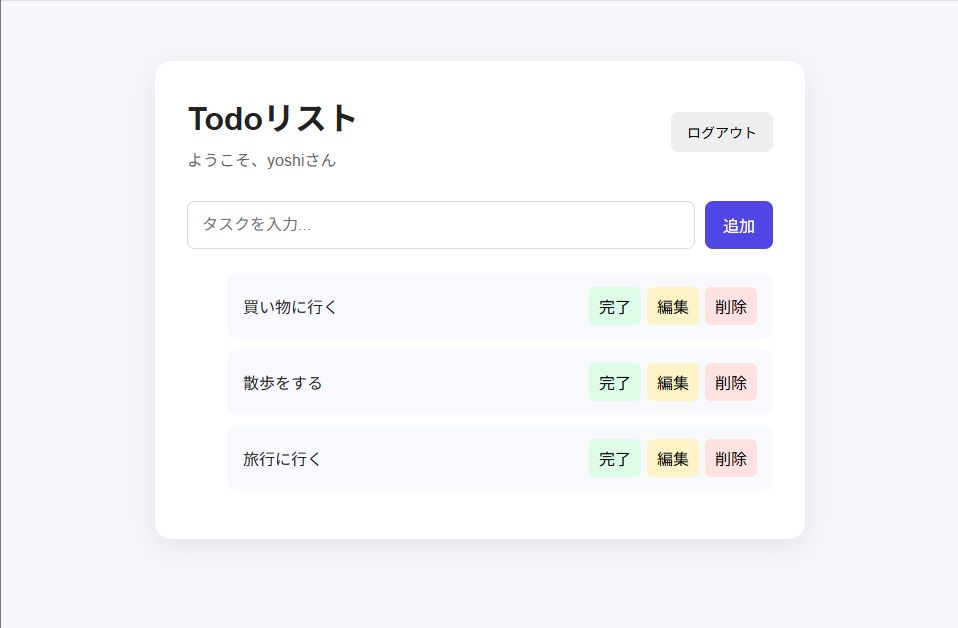

# React Flask Todo App

ReactとFlaskを使用したTodo管理Webアプリです。

ユーザー登録・ログイン機能を備えており、
ユーザーごとにTodoを管理できます。

## 公開URL

https://react-flask-todo.onrender.com

## スクリーンショット

## 主な機能

- ユーザー新規登録
- ログイン・ログアウト
- Todoの追加
- Todoの編集
- Todoの削除
- Todoの完了・未完了切り替え
- ユーザーごとのTodo管理

## 使用技術

### Frontend
- React
- Vite
- React Router
- JavaScript

### Backend
- Python
- Flask
- Flask-JWT-Extended
- Gunicorn

### Database
- PostgreSQL

### Deployment
- Render

## 認証

JWT (JSON Web Token) を使用してユーザー認証を実装しています。
パスワードはハッシュ化してデータベースに保存しています。